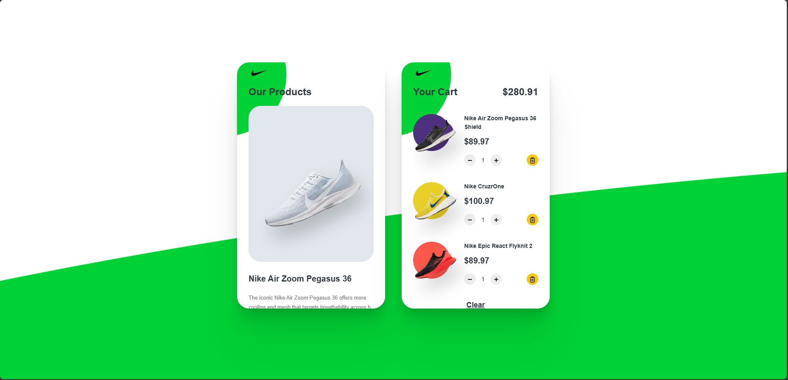

# G-Sneaker TEST

Link project: https://github.com/SyManh1003/Intern_test

# How to run:
*step1: Clone Project.
*step2: Import database from the shoes.json or web_intern.sql file in the app/data folder path.
*step3: Start Apache, MySQL and run the project.
